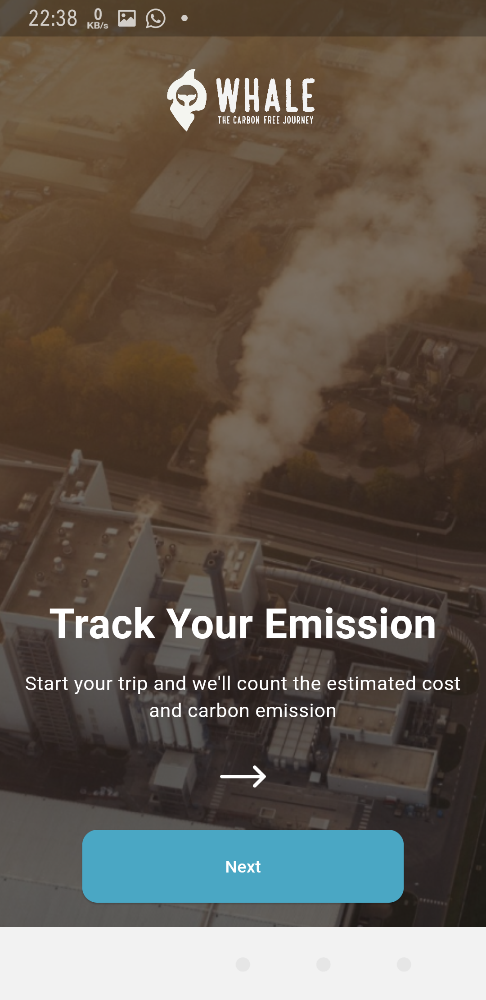
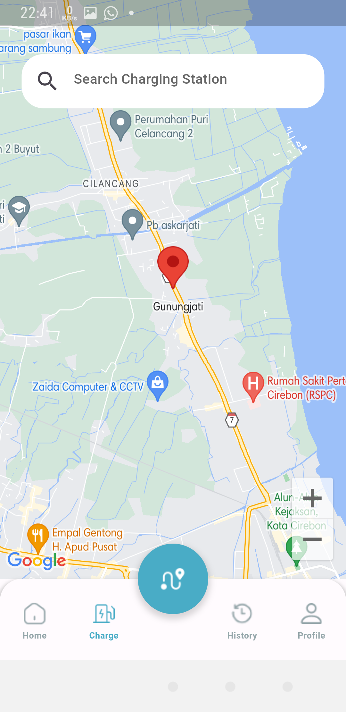

# DOWNLOAD APPS IN <a href="https://github.com/egapermana24/whale-lumitech/raw/main/app_release/whale.apk">HERE</a>
### Because when debugging requires SHA-1 and SHA-256 on each local computer which is then placed in our application's Firebase, it's best to just <a href="https://github.com/egapermana24/whale-lumitech/raw/main/app_release/whale.apk">download the ready-made application</a> if you want to check.
**apps in folder app_release*


# Getting Started with Code

Our application currently only supports Android devices, so to run the code, please use an Android emulator or an Android device with debugging mode.

Type in the terminal at this project location (depending on where you save it after downloading):

```dart
flutter pub get
```

after that

```dart
flutter run
```

# LUMITECH

</img>


# WHALE

Whale cuts your carbon footprint by tracking emissions and suggesting
eco-friendly, cost-efficient transport alternative. Make green travel
choices effortlessly with real-time emission data and incentives.
Smart, sustainable, and simple. Choose Whale for a greener commute.

We developed the Whale application in a mobile format to provide
easy access, real-time monitoring, and high user engagement.
Leveraging smartphone features such as sensors and
notifications, Whale delivers an interactive experience that
facilitates carbon emission monitoring, travel cost estimation,
and practical selection of sustainable transportation options.

# SCREENSHOOT APPS

<table style="border-collapse: collapse;">
  <tr>
    <td align="center">
      
    </td>
    <td align="center">
      
    </td>
    <td align="center">
      
    </td>
  </tr>
  <!-- Add more rows as needed -->
  <tr>
    <td align="center">
      
    </td>
    <td align="center">
      
    </td>
    <td align="center">
      
    </td>
  </tr>
  <!-- Add more rows as needed -->
  <tr>
    <td align="center">
      
    </td>
    <td align="center">
      
    </td>
    <td align="center">
      
    </td>
  </tr>
  <!-- Add more rows as needed -->
  <tr>
    <td align="center">
      
    </td>
    <td align="center">
      
    </td>
    <td align="center">
      
    </td>
  </tr>
  <!-- Add more rows as needed -->
  <tr>
    <td align="center">
      
    </td>
    <td align="center">
      
    </td>
    <td align="center">
      
    </td>
  </tr>
</table>

