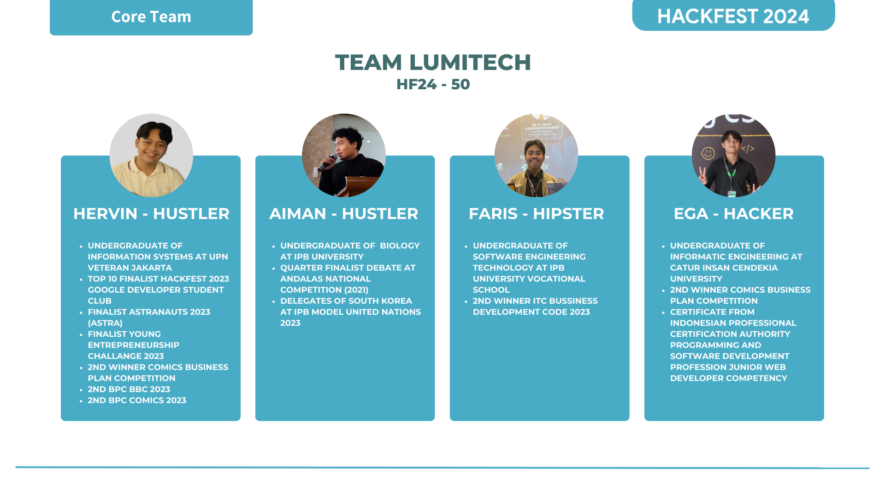

# Getting Started

Type in the terminal at this project location (depending on where you save it after downloading):

flutter pub get

after that

flutter run

# LUMITECH

</img>

# WHALE

Whale cuts your carbon footprint by tracking emissions and suggesting
eco-friendly, cost-efficient transport alternative. Make green travel
choices effortlessly with real-time emission data and incentives.
Smart, sustainable, and simple. Choose Whale for a greener commute.

We developed the Whale application in a mobile format to provide
easy access, real-time monitoring, and high user engagement.
Leveraging smartphone features such as sensors and
notifications, Whale delivers an interactive experience that
facilitates carbon emission monitoring, travel cost estimation,
and practical selection of sustainable transportation options.
